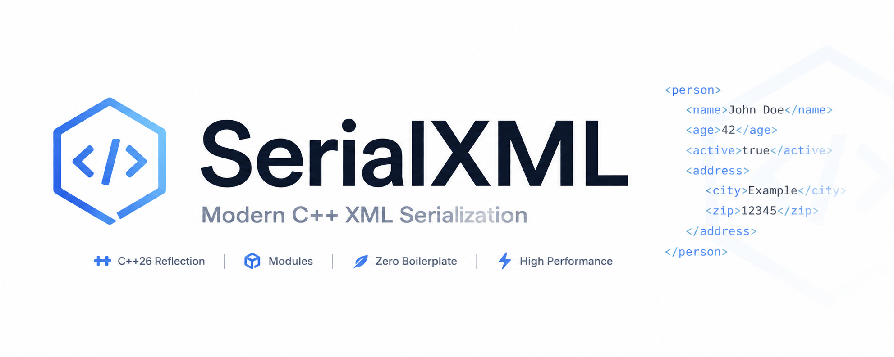

# SerialXML




> Reflection based XML serialization for C++26 -- call `to_xml` on any object for a string version

SerialXML is a C++26 reflection based serialization library for XML. Behaviour is configurable via annotations on object members and object type declarations (`class/struct`).

## Get Started

Getting started is easy, just call one function on any regular C++ struct. No modifications required to anything! Simply import the module and call `to_xml`.

```cpp
// main.cpp

import std;
import serial_xml;

struct Person {
    int age;
    std::string favorite_food;
}

int main() {
    std::print(to_xml(Person{3, "pizza"}));
}
```

That's all you need: one function call and SerialXML does the rest.

## Installation

### CMake FetchContent (Recommended)

```cmake
FetchContent_Declare(
    serial_xml
    GIT_REPOSITORY https://github.com/EJainDev/SerialXML.git
    GIT_TAG v1.0.0.0
)
FetchContent_MakeAvailable(serial_xml)

add_executable(my_tests test.cpp)
target_link_libraries(my_tests PRIVATE serial_xml::serial_xml)
```

### Install from source

```bash
git clone https://github.com/EJainDev/SerialXML.git
cd SerialXML

cmake --preset "release-gcc-16"
cmake --build build

cmake --install build
```

Then, in your `CMakeLists.txt`, put:
```cmake
find_package(SerialXML REQUIRED)
target_link_libraries(my_app PRIVATE serial_xml::serial_xml)
```

### Requirements

| Component | Min Version | Notes |
| --------- | ----------- | ----- |
Compiler | GCC 16.1 | C++26 SIMD, Reflection, and more |
CMake | 4.3 | Change `std` experiment key for lower versions |
C++ Standard | 26 | SIMD, Reflection, Annotations |

## Features

You can use the various annotations provided by the library to control how your struct is parsed. The best part is that it's all compile time. No runtime overhead. Any object that supports `std::format` is formattable immediately.

- `to_xml` -- The main function to serialize your struct. The optional second parameter is a boolean dictating whether to add the XML 1.0 declaration line: `<?xml version=\"1.0\" encoding=\"UTF-8\"?>`. Passing `true` (the default) adds it and pass `false` to disable it.
- `[[=attribute]]` -- Mark a struct member as an attribute instead of a child.
- `[[=raw]]` -- Mark a struct member to be emitted as raw text instead of being surrounded by closing tags inside the body of the struct.
- `[[=skip]]` -- Don't include this struct member in the generated XML output.
- `[[=name{"custom_name"}]]` -- Specify the name of this attribute or child tag to be something other than the name of the member. Note: You can also specify this on the struct to control its closing tag (eg. generate `person` instead of `Person` for `struct Person` with `[[=name{"person"}]]`).
- `[[=unpack]]` -- Instead of calling `std::format` on the member object, generate an enclosing XML tag for each of its children.
- `[[=no_unpack]]`-- Call `std::format` on the member object instead of breaking it down into its children. Opposite of `unpack`
- `[[=iter{a, b}]]` -- For classes satisfying `std::ranges::range`, iterate through each member instead of directly calling `std::format`. The first (optional) parameter is the name of the tag for each element in the range. The second (optional) parameter is the name of the range tag enclosing each element.
- `[[=no_iter]]` -- The opposite of `iter` to disable automatic iteration of STL ranges. See the confusion points for more information on STL handling.
- `[[=format{"format_specifier"}]]` -- Add a format specifier in the call to `std::format` for that member. Do not prefix with a colon (`:`) as the library handles that on its own.

### Common Confusion Points

1. For *some* STL containers, the library automatically iterates through them. Therefore, your generated XML will not match the expectations. To avoid this, add the `[[=no_iter]]` annotation to object member.