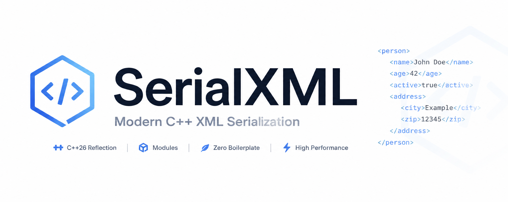

# SerialXML




> Reflection based XML serialization and deserialization for C++26

SerialXML is a C++26 reflection based serialization library for XML. Behaviour is configurable via annotations on object members and object type declarations (`class/struct`). Invalid annotation combinations are diagnosed at compile time. Deserialization reports malformed XML, missing required members, and invalid values through `serial_xml::deserialization_error`.

## Table of Contents
* [Quick Start](#quick-start)
* [Installation](#installation)
  * [FetchContent](#cmake-fetchcontent-recommended)
  * [Source](#install-from-source)
  * [Requirements](#requirements)
* [Benchmarks](#benchmarks)
* [Deserialization](#deserialization)
* [Annotations](#annotations)
  * [Common Confusion Points](#common-confusion-points)
  * [Configuring `to_xml`](#configuring-to_xml)
  * [Mocking classes](#mocking-classes)
  * [The `prettify` function](#the-prettify-function)
* [Examples](#examples)
* [Contributing](#contributing)
* [License](#license)

## Quick Start

Getting started is easy. Simply import the module and call `to_xml` on any regular C++ struct. No modifications required to anything!

```cpp
// main.cpp

import std;
import serial_xml;

struct Person {
    int age;
    std::string favorite_food;
}

int main() {
    std::print(to_xml(Person{3, "pizza"}));
}
```

That's all you need: one function call and SerialXML does the rest.

## Deserialization

`serial_xml::from_xml<T>(xml)` constructs a value-initialized `T` and reconstructs it
using the same member names, attributes, nesting, iteration, escaping, and mock
annotations as `to_xml`. `serial_xml::from_xml<T, Schema>(xml)` uses an external mock
schema. Both accept an optional root-name override as their second argument.
For an existing object, including one without a default constructor, use
`serial_xml::from_xml<Schema>(object, xml, fixed_name)`; omit `Schema` for the object's
own annotations. The in-place form snapshots the input so XML stored in an updated
field remains safe, and parses it before updating the object. A later conversion
error or throwing setter can leave earlier members updated.

```cpp
struct Person {
    [[= serial_xml::attribute]] int age;
    std::string name;
    [[= serial_xml::optional]] std::string nickname = "unknown";
};

auto person = serial_xml::from_xml<Person>(
    "<Person age='21'><name>Ekansh</name></Person>");
// person.nickname remains "unknown".
```

Members are **required** unless marked `[[= serial_xml::optional]]`, skipped, or
omitted naturally by serialization. Unless explicitly marked `optional`, missing `std::optional<T>` members are reset
to `std::nullopt`; missing automatically iterated `exclude_on_empty` members are
reset to an empty value.
An absent explicitly optional member keeps its initializer (or its current value
with the in-place API). An empty element counts as present: it produces an empty
string or range but fails numeric conversion. Fixed arrays require the exact
number of elements. Raw ranges may have no elements because their enclosing tag
is omitted. Skipped fields and unselected mock fields keep their initialized values.
Unknown attributes and child elements are ignored; duplicate matched singleton
elements and duplicate XML attributes are rejected. XML child/attribute order
is otherwise independent of C++ member order.

### Leaf conversion with `from_string`

Every non-unpacked leaf is converted through
`serial_xml::from_string<T>(std::string_view)`. Built-in implementations cover
arithmetic types (including booleans), `std::string`, `std::optional`, pairs,
tuples, and owning STL sequences, sets, and maps. Numbers must consume the entire
input after trimming surrounding XML whitespace; overflow and invalid text throw
`deserialization_error`. Booleans accept `true`, `false`, `1`, and `0`; characters
use their numeric value, matching `to_xml`. Strings retain whitespace.

Container conversion reads the standard formatted representations, such as
`[1, 2]`, `(1, "text")`, and `{"key": 3}`, including nested containers and quoted
strings. XML iteration handles `vector`, `array`, `inplace_vector`, `deque`,
`forward_list`, and `valarray` automatically. Use `iter` for other owning ranges.
Borrowed views (`span`, `string_view`, pointers) have no built-in reconstruction:
provide an implementation with an appropriate storage lifetime if you need them.

A custom leaf type requires an explicit specialization, declared before the first
call that needs it. An unpacked class uses reflection instead.

```cpp
struct Code { int value; };

template <>
Code serial_xml::from_string<Code>(std::string_view text) {
    return {serial_xml::from_string<int>(text)};
}
```

`format` continues to determine whether a value is represented as text.
Deserialization passes that text to `from_string`; it does not try to invert
custom formatter functions or lossy format strings. Decimal zero padding works
with the default numeric parser. Custom prefixes, hexadecimal representations,
alignment fill, or other representations need a matching `from_string`
implementation. Lost precision cannot be recovered.

### Setters and encapsulation

Accessible const getters can be reconstructed through a matching non-static setter
with exactly one parameter of the same value type (references and cv qualifiers
are ignored). Supported conventions are `value()` → `value(T)` or `set_value(T)`,
`get_value()` → `set_value(T)`, and `getValue()` → `setValue(T)`. XML naming and
annotations come from the getter. Getters without a matching setter are ignored
by deserialization. Non-function members that cannot be assigned produce a
compile-time error; mark them `skip` to omit them.

Use `[[= serial_xml::setter]]` to select a method independently, without requiring
a getter. It must be an accessible non-static method with one parameter. Its
parameter type controls reconstruction, and its own annotations control XML
naming, attributes, optionality, and iteration. By default `set_value` reads
`value` and `setValue` reads `value`; other method names are used literally.
`name` overrides this. Setters are ignored by `to_xml`.

```cpp
class Account {
 public:
    [[= serial_xml::skip]] int balance() const { return balance_; }
    [[= serial_xml::setter, = serial_xml::name{"balance"}]]
    void deposit_balance(int amount) { balance_ = amount; }
 private:
    int balance_ = 0;
};
```

An explicitly selected setter takes precedence over automatic reconstruction of
its matching getter, so it is invoked once. Setter annotations can also live on
a mock schema; placeholder methods do not need definitions. Ambiguous setter
overloads are diagnosed at compile time.

### XML input and text annotations

The reader supports UTF-8 XML 1.0, a UTF-8 BOM, XML declarations, quoted attributes,
self-closing elements, comments, processing instructions, CDATA, the five predefined
entities, and decimal/hexadecimal Unicode character references. It rejects
mismatched tags, invalid characters/UTF-8, unclosed structures, invalid numeric
values, missing required members, and multiple roots. DTDs and external entities
are unsupported. Namespace prefixes are matched literally; namespace declarations
are not resolved. Nesting is limited to 256 elements. Line endings and literal
attribute whitespace follow XML normalization rules.

`raw` scalar fields read the parent's direct text; more than one raw scalar field
cannot be separated and causes an error. `raw` ranges read matching item tags
directly from the parent. Unpacked objects and automatically handled optionals
keep their tagged representation even with `raw`, following `to_xml` precedence. CDATA fields read the parent's CDATA sections in member
order, matching `to_xml`'s unwrapped CDATA output. Optional or externally split
CDATA fields can be ambiguous; use tagged string fields when boundaries must be
unambiguous. Standard tagged string fields can contain mixed ordinary text and
CDATA sections, which are concatenated.

See [the deserialization example](examples/deserialization.cpp) for round trips,
custom string conversion, optional fields, and independent setters.

## Installation

### CMake FetchContent (Recommended)

```cmake
FetchContent_Declare(
    serial_xml
    GIT_REPOSITORY https://github.com/EJainDev/SerialXML.git
    GIT_TAG main
)
FetchContent_MakeAvailable(serial_xml)

add_executable(my_tests test.cpp)
target_link_libraries(my_tests PRIVATE serial_xml::serial_xml)
```

### Install from source

```bash
git clone https://github.com/EJainDev/SerialXML.git
cd SerialXML

cmake --preset "release-gcc-16"
cmake --build build

cmake --install build
```

Then, in your `CMakeLists.txt`, put:
```cmake
find_package(SerialXML REQUIRED)
target_link_libraries(my_app PRIVATE serial_xml::serial_xml)
```

### Requirements

| Component | Min Version | Notes |
| --------- | ----------- | ----- |
Compiler | GCC 16.1 | C++26 SIMD, Reflection, and more |
CMake | 4.3 | Change `std` experiment key for lower versions |
C++ Standard | 26 | SIMD, Reflection, Annotations |

## Benchmarks

The same executable compares serialization and deserialization with SerialXML,
Boost.Serialization XML archives, cereal XML archives, and pugixml. Every library
handles the same logical order: customer details, a shipping address, three line
items, and four integer tags. Each library reads its own serialized representation;
archive metadata and container tag names differ, so compare time per order rather
than XML bytes per second.

Measured on October 9, 2026, with GCC 16.2.0, the Release preset (`-O3 -DNDEBUG`),
and an Intel Core 7 240H. Results are the median of five optimized runs from
alternating before/after pairs, each pinned to logical CPU 4 (a performance core),
with 100,000 measured iterations and 1,000 warm-up iterations per library and
operation. Lower times are better.

| Library | Serialization (ns/order) | Deserialization (ns/order) | XML input bytes |
| --- | --- | --- | --- |
| SerialXML | 830.308 | 849.361 | 708 |
| Boost.Serialization | 6959.951 | 14250.021 | 1111 |
| cereal | 7699.705 | 3195.171 | 936 |
| pugixml | 1523.398 | 936.498 | 671 |

The optimized deserializer uses borrowed input views, an 8 KiB stack-backed
bump arena with heap fallback, stable append-only node lists, a single validated
scan for plain text, and field lookup specialized for constant schema names.
Destination ranges reserve their final size. Heap allocations for this order
dropped from 67 to 5. Returned strings and containers own their contents; the
temporary views and arena do not escape reconstruction.

Five alternating before/after benchmark pairs on the same CPU measured SerialXML
deserialization at 3,887.278 ns before and 849.361 ns after: approximately **4.6×
faster**. Serialization measured 854.624 ns before and 830.308 ns after, with no
measured regression; its implementation is unchanged by these optimizations.
SerialXML beat all three existing comparators in every optimized run. Its median
deserialization time was approximately 9% lower than pugixml's, 3.8× faster than
cereal, and 16.8× faster than Boost. These local measurements of a small order
are not a general ranking across XML workloads.

Deserialization includes XML parsing, numeric conversion, construction of an
owning result object, and cleanup. Input XML is prepared outside the timed loops.
All reconstructed fields are checked before timing; compiler barriers keep timed
results observable. The pugixml comparison uses handwritten field mapping for
valid input, whereas SerialXML also checks required members. Serialization
includes completion and destruction of output archives before capturing the XML;
these results supersede the historical table that captured archive output early.

Reproduce with the repository's GCC 16 dev container:

```sh
cmake --preset release-test-gcc -DBUILD_BENCHMARKS=ON
cmake --build --preset build-release-test
ctest --test-dir build/release --output-on-failure
taskset -c 4 ./build/release/benchmarks/xml_serialization_benchmarks 100000 1000
```

The two optional arguments specify measured and warm-up iteration counts. Omit
`taskset -c 4` or choose an available performance-core CPU on another machine.
Repeat the benchmark five times sequentially to compare median timings. The
executable reports both operations and the XML input sizes, and refuses to time
payloads that fail round-trip validation.

## Annotations

This library is annotation driven, which means that most customization points are exposed via C++26 annotations. The reason behind this design choice is to create consistency and visually associate the output structure to the definition.

By default, all members are treated as children of the parent struct with closing tags the same as the name of the member. However, if a struct is not formattable, it by default is unpacked. Many STL ranges and the `std::optional` container are also handled by default. A `std::optional` member is omitted if it does not contain a value.

This is the complete list of annotations:
- `[[=attribute]]` -- Mark a struct member as a XML attribute instead of a child.
- `[[=raw]]` -- Mark a struct member to be emitted as raw text instead of being surrounded by closing tags with the same name as the member.
- `[[=skip]]` -- Don't include this struct member in the generated XML output.
- `[[=name{"custom_name"}]]` -- Specify the name of this attribute or child tag to be something other than the name of the member. Note: You can also specify this on the struct to control its closing tag (eg. generate `person` instead of `Person` for `struct Person` with `[[=name{"person"}]]`).
- `[[=unpack]]` -- Instead of calling `std::format` on the member object, generate an enclosing XML tag for it and serialize its members as well.
- `[[=no_unpack]]` -- Call `std::format` on the member object instead of breaking it down into its children. Opposite of `unpack`.
- `[[=iter{a, b}]]` -- For classes satisfying `std::ranges::range`, iterate through each member instead of directly calling `std::format`. The first (optional) parameter is the name of the tag for each element in the range. The second (optional) parameter is the name of the range tag enclosing each element.
- `[[=no_iter]]` -- The opposite of `iter` to disable automatic iteration of STL ranges. See the confusion points for more information on STL handling.
- `[[=format{"format_specifier"}]]` -- Add a format specifier in the call to `std::format` for that member. Do not prefix with a colon (`:`) as the library handles that on its own. `[[=format{format_function}]]` instead calls a custom formatting function that accepts the member value and returns a string-like value.
- `[[=setter]]` -- Mark a one-parameter method as an independent XML input property.
- `[[=optional]]` -- Allow a field or selected setter to be absent during reconstruction.
- `[[=cdata]]` -- Emit the value inside `cdata` (`<![CDATA[your_content]]>`) tags.
- `[[=exclude_on_empty]]` -- Do not emit any tags when the range is empty

### Common Confusion Points

1. For *some* STL containers, the library automatically iterates through them. Therefore, your generated XML will not match the expectations. To avoid this, add the `[[=no_iter]]` annotation to object member. The current list of STL containers that are automatically iterated:
    - `std::vector`
    - `std::array`
    - `std::inplace_vector`
    - `std::deque`
    - `std::forward_list`
    - `std::span`
    - `std::valarray`
1. The precedence order for STL handled ranges is as follows:
    1. `exclude_on_empty`
    1. `raw` -- note that this only applies to the outer layer of tags for the range. Not each individual element in the range
    1. `cdata`
1. The precedence order for children is as follows:
    1. STL Handling (see above)
    1. `raw`
    1. Iteration
    1. Unpacking
    1. CData
1. `format` is ignored for unpacked or iterated members

### Configuring `to_xml`

The function signature of `to_xml` is the following:

```
template <typename Mock = void, typename T>
  requires(std::is_class_v<T> && (std::is_void_v<Mock> || std::is_class_v<Mock>))
auto to_xml(const T& value, bool first = true, const std::string& fixed_name = "") -> std::string;
```

As you can see, there are some parameters for configuration"
- `value` -- the instance of the class to serialize
- `first` -- a bool indicating whether to insert the XML header defining the file as XML. `true` means yes
- `fixed_name` -- a custom name to specify for the instance being serialized. Overrides `name` annotation.

### Mocking classes

Use `to_xml<Mock>(value)` to serialize a class you cannot annotate directly:

```cpp
class mock_vector {
 public:
  [[= serial_xml::attribute]] std::size_t size() const;
};

const std::vector<int> values{1, 2, 3};
std::println("{}", serial_xml::to_xml<mock_vector>(values, false));
// <vector size="3"/>
```

The mock lists the fields and const getters to serialize, in output order, and supplies their XML annotations. Member identifiers must match accessible members of the actual class. Field placeholders match fields; getter placeholders match non-static const getters callable without arguments (including getters with default arguments). Mock methods need no implementation, and the mock is never constructed. Serialization reads values from the actual object, using its member types for formatting, iteration, and nested serialization. Target member annotations are replaced by the mock's annotations; nested objects use their own annotations normally.

The root name defaults to the actual type's identifier. A `name` annotation on the
mock overrides it, and `fixed_name` overrides both. Members marked `skip` need not
exist on the target. Missing members, incompatible field/getter kinds, and
ambiguous callable const overloads produce compile-time errors. Mapping covers
direct accessible members; inherited members are not included.

The identifier map is built once per concrete target type, such as
`std::vector<int>`, during constant evaluation. It uses an open-addressed hash
table with at most 50% occupancy and expected O(1) member lookup after hashing the
identifier. Hash collisions are resolved by probing and comparing identifiers;
worst-case lookup is O(N). This avoids a target-member template expansion or a
linear scan of all target members for every mock member. No map or name lookup
runs during serialization. Calling `to_xml(value)` still serializes normally.

See [the mocking example](examples/mocking.cpp).

### The `prettify` function

A simple function to prettify (add indentation and newlines) the generated XML output. The only parameter is the output and it returns a new string with the output.

## Examples

The [`examples`](examples) directory contains small, standalone programs for each
major SerialXML feature. Examples are built by default; configure the project and
run an executable from the build directory, for example:

```bash
cmake --preset "release-gcc-16"
cmake --build build
./build/examples/hello_world
```

Set `-D BUILD_EXAMPLES=OFF` when configuring CMake to omit them from your build.

| Example | Demonstrates |
| ------- | ------------ |
| [`hello_world.cpp`](examples/hello_world.cpp) | A minimal struct-to-XML serialization. |
| [`attributes.cpp`](examples/attributes.cpp) | Emitting members as XML attributes. |
| [`named_tags.cpp`](examples/named_tags.cpp) | Naming root elements, attributes, and child tags. |
| [`skip_members.cpp`](examples/skip_members.cpp) | Excluding members from the output. |
| [`nested_structs.cpp`](examples/nested_structs.cpp) | Recursive serialization of nested structs and nested attributes. |
| [`deserialization.cpp`](examples/deserialization.cpp) | Round trips, custom leaf conversion, optional reconstruction, and setters. |
| [`stl_containers.cpp`](examples/stl_containers.cpp) | Automatic container iteration, `exclude_on_empty`, and `no_iter`. |
| [`iteration.cpp`](examples/iteration.cpp) | Custom element and container names for ranges, including ranges of structs. |
| [`optional_types.cpp`](examples/optional_types.cpp) | Omitting empty `std::optional` values and serializing present values. |
| [`raw_cdata.cpp`](examples/raw_cdata.cpp) | Raw text and CDATA output. |
| [`format_specifiers.cpp`](examples/format_specifiers.cpp) | Passing format specifications through to `std::format`. |
| [`escaping.cpp`](examples/escaping.cpp) | Escaping XML-special characters in children, attributes, and raw text. |
| [`advanced_mixed.cpp`](examples/advanced_mixed.cpp) | A combined example using attributes, named tags, nesting, iteration, and escaping. |

## Contributing

Please read [CONTRIBUTING.md](CONTRIBUTING.md) for details on the process for submitting pull requests to us.

## License

This project is licensed under the MIT License - see the [LICENSE](LICENSE) file for details.
